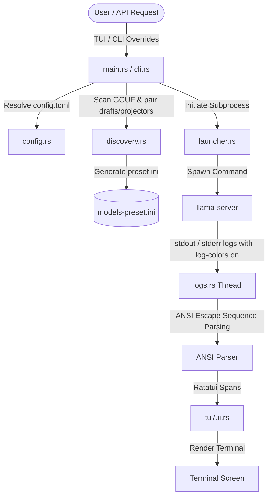

# Architecture & System Design

This document details the high-level architecture, module flow, and component organization of `Llama-Herd`.

## System Architecture

Llama-Herd is structured around isolated Rust modules separating configurations, launcher subprocesses, heuristics, and terminal render engines.



## Component Breakdown

1. **Entry Point & Command Router ([src/main.rs](file:///home/rpr/dev/llama-herd/src/main.rs), [src/cli.rs](file:///home/rpr/dev/llama-herd/src/cli.rs))**: Resolves environment parameters (resolving base paths via `LLAMA_PATH`), handles command-line arguments (like `--cli` and `--ini` modes), loads the global `config.toml`, and manages the early-exit or terminal transitions between TUI and CLI.
2. **Subprocess Orchestrator ([src/launcher.rs](file:///home/rpr/dev/llama-herd/src/launcher.rs))**: Responsible for constructing the precise command line arguments required by `llama-server` for both Single Preset and Router Modes. It manages cross-platform process termination (e.g., calling `pkill` on UNIX or `taskkill` on Windows) to prevent background port collisions.
3. **Asset Discovery & Heuristics ([src/discovery.rs](file:///home/rpr/dev/llama-herd/src/discovery.rs))**: Scans files, cleans file stems to normalized names, matches compatible draft models (by scanning for `draft`/`assistant` tokens), and finds vision projectors (`mmproj`). It is also responsible for compiling the configuration mappings into `models-preset.ini` for on-demand loading.
4. **Configuration Safety Layer ([src/config.rs](file:///home/rpr/dev/llama-herd/src/config.rs))**: Implements strict TOML rule enforcement. It prevents common user-defined key errors (e.g., keys containing underscores or starting with dashes are skipped with warning logs), parses context size keywords (such as `"8k"` to `8192`), and parses local presets.
5. **Interactive UI Engine ([src/tui/mod.rs](file:///home/rpr/dev/llama-herd/src/tui/mod.rs), [src/tui/app.rs](file:///home/rpr/dev/llama-herd/src/tui/app.rs), [src/tui/ui.rs](file:///home/rpr/dev/llama-herd/src/tui/ui.rs))**: An event-driven interface written on top of `ratatui` and `crossterm` handling keyboard events, overlay screens, parameter overrides, and rendering state transitions.
6. **Concurrent Log Manager ([src/tui/logs.rs](file:///home/rpr/dev/llama-herd/src/tui/logs.rs))**: Asynchronously consumes stdout and stderr streams of the spawned `llama-server` process. It feeds lines through a regex-based SGR (Select Graphic Rendition) parser to convert raw ANSI coloring escape codes to Ratatui style attributes, keeping background buffers paused or active on demand.

## Directory Structure

```text
llama-herd/
├── Cargo.toml            # Project dependencies & configurations
├── GEMINI.md             # Architecture guidelines & project mandates
├── README.md             # Developer handbook & user manual
├── docs/                 # Documentation folder
│   └── superpowers/      # Feature-specific designs & plans
│       ├── plans/
│       └── specs/
└── src/                  # Rust source code
    ├── main.rs           # Entry point & setup
    ├── cli.rs            # CLI interface & option parser
    ├── config.rs         # Safe config parser & rules validator
    ├── discovery.rs      # Heuristics & model auto-pairing
    ├── launcher.rs       # Subprocess orchestrator
    └── tui/              # Terminal User Interface modules
        ├── mod.rs        # TUI entry point & event loop
        ├── app.rs        # Application state machine
        ├── ui.rs         # Ratatui rendering layout
        └── logs.rs       # Stream logger & ANSI parser
```
