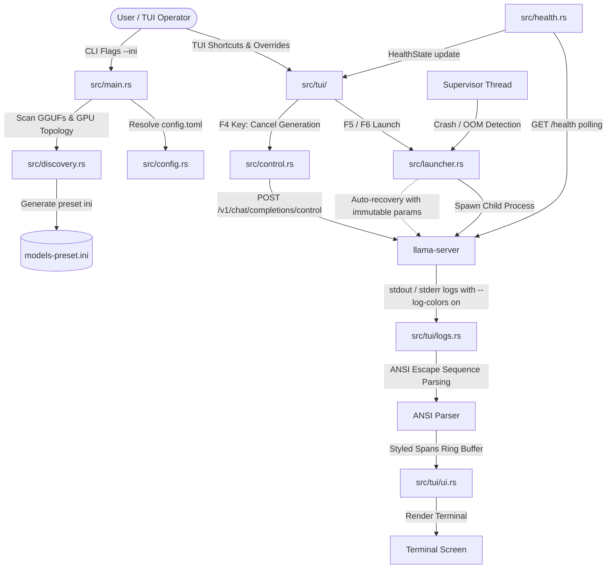

# Architecture & System Design

This document details the high-level architecture, module flow, and component organization of `Llama-Herd`.

## System Architecture

Llama-Herd is structured around isolated Rust modules separating configurations, launcher subprocesses, heuristics, health monitoring, and terminal render engines.


```mermaid
graph TD
    User([User / TUI Operator]) -->|TUI Shortcuts & Overrides| TUI[src/tui/]
    User -->|CLI Flags --ini| Main[src/main.rs]
    Main -->|Resolve config.toml| Config[src/config.rs]
    Main -->|Scan GGUFs & GPU Topology| Discovery[src/discovery.rs]
    Discovery -->|Generate preset ini| PresetFile[(models-preset.ini)]
    TUI -->|F5 / F6 Launch| Launcher[src/launcher.rs]
    Launcher -->|Spawn Child Process| LlamaServer[llama-server]
    LlamaServer -->|stdout / stderr logs with --log-colors on| LogStream[src/tui/logs.rs]
    LogStream -->|ANSI Escape Sequence Parsing| Parser[ANSI Parser]
    Parser -->|Styled Spans Ring Buffer| UI[src/tui/ui.rs]
    HealthPoller[src/health.rs] -->|GET /health polling| LlamaServer
    HealthPoller -->|HealthState update| TUI
    TUI -->|F4 Key: Cancel Generation| Control[src/control.rs]
    Control -->|POST /v1/chat/completions/control| LlamaServer
    Supervisor[Supervisor Thread] -->|Crash / OOM Detection| Launcher
    Launcher -.->|Auto-recovery with immutable params| LlamaServer
    UI -->|Render Terminal| Screen[Terminal Screen]
```

## Component Breakdown

1. **Entry Point & Command Router ([src/main.rs](../src/main.rs))**: Resolves configuration paths (loading from platform-specific directories), handles command-line arguments (like `--ini` preset generation mode), loads global `config.toml`, and manages early-exit or terminal transitions.
2. **Subprocess Orchestrator & Supervisor ([src/launcher.rs](../src/launcher.rs), [src/tui/logs.rs](../src/tui/logs.rs))**: Constructs precise command line arguments required by `llama-server` for Single Preset and Router Modes. Tracks active subprocess PIDs in `active_pids.txt` to terminate stray or orphaned instances cleanly via `sysinfo`. Implements the **Subprocess Supervisor & Auto-Recovery Engine**, monitoring child process exit codes and automatically respawning crashed instances using immutable launch parameters (`SupervisorConfig`) without parameter drift.
3. **Asset Discovery & Hardware Topology Scanner ([src/discovery.rs](../src/discovery.rs))**: 
   - Scans model directories, normalizes model names, and runs pairing heuristics to match compatible speculative drafts (`draft`/`assistant` tokens) and multimodal vision projectors (`mmproj`), stripping size tags, quants, and precision markers (`F32`, `FP32`, `BF16`, `F16`).
   - Supports preset variant filtering (`variants`), resolves custom preset section names (`[llama-herd.custom-name]`), and compiles clean configuration mappings into `models-preset.ini` for on-demand loading (without redundant `[default]` sections), ensuring accurate variant selection persistence.
   - Scans system GPU hardware topology across CUDA (`nvidia-smi`), ROCm (`rocm-smi` / sysfs), and WDDM. Calculates ratio-based `--tensor-split` with a 10–15% (default 12%) safety headroom buffer and injects `--fit-on` / `-fitt 1024` flags for multi-GPU setups.
4. **Configuration Safety Layer ([src/config.rs](../src/config.rs))**: Implements strict TOML rule enforcement. Prevents key errors (keys with underscores or leading dashes are rejected), checks values against command/option injection, strictly validates context size suffixes (`'k'`/`'K'`), and maintains lists of restricted parameters (including `custom-name`, `custom-names`, and `variants`, while ignoring deprecated options like `is-default`).
5. **Health Monitoring Engine ([src/health.rs](../src/health.rs))**: Periodically polls `GET /health` on the active `llama-server` instance. Classifies statuses into `HealthState` (`Healthy`, `Loading`, `Unhealthy`, `Recovering`) and implements startup confirmation guards to prevent transient Windows socket timeouts from downgrading verified healthy servers.
6. **Direct Control Dispatcher ([src/control.rs](../src/control.rs))**: Issues REST cancellation signals to `POST /v1/chat/completions/control` upon pressing `F4`, immediately interrupting in-flight inference generations without killing the server.
7. **Interactive UI Engine ([src/tui/mod.rs](../src/tui/mod.rs), [src/tui/app.rs](../src/tui/app.rs), [src/tui/ui.rs](../src/tui/ui.rs), [src/tui/theme.rs](../src/tui/theme.rs), [src/tui/picker.rs](../src/tui/picker.rs))**: An event-driven interface built with `ratatui` (0.30) and `crossterm` (0.29). Manages state transitions, keyboard shortcuts (`F1`–`F8`), parameter overrides (including `Custom Name` per variant), active-writes stability checks for hot reloading, themed components, and interactive modal pickers.
8. **Concurrent Log Manager ([src/tui/logs.rs](../src/tui/logs.rs))**: Asynchronously consumes stdout and stderr streams of the spawned `llama-server`. Parses ANSI SGR color sequences into Ratatui styles, maintains a 2000-line ring buffer, and supports autoscroll toggling (`A` / `Space`), pausing (`P`), line wrapping (`W`), and clipboard copying (`C`).
9. **Interactive Setup Wizard ([src/setup.rs](../src/setup.rs))**: Interactive TUI initialization flow that prompts users for missing environment paths (like `llama-server` executable or models directory) and persists them to the global configuration.

## Directory Structure

```text
llama-herd/
├── Cargo.toml            # Project dependencies & configurations
├── AGENTS.md             # Developer guidelines & AI agent mandates
├── GEMINI.md             # Architecture guidelines & project mandates
├── README.md             # Developer handbook & user manual
├── docs/                 # Documentation folder
│   ├── architecture.md   # System design & architecture breakdown
│   ├── configuration.md  # Configuration reference & performance guide
│   ├── theming.md        # Hybrid theme system guide
│   └── superpowers/      # Feature-specific designs & plans
│       ├── plans/
│       └── specs/
└── src/                  # Rust source code
    ├── main.rs           # Entry point & CLI handler
    ├── config.rs         # Safe config parser & rules validator
    ├── control.rs        # Generation cancellation control dispatcher
    ├── discovery.rs      # Heuristics, topology scanner & preset generator
    ├── health.rs         # REST health checking & state classifier
    ├── launcher.rs       # Subprocess orchestrator & supervisor config
    ├── setup.rs          # Interactive setup wizard
    └── tui/              # Terminal User Interface modules
        ├── mod.rs        # TUI entry point & event loop
        ├── app.rs        # Application state machine
        ├── ui.rs         # Ratatui rendering layout & status panel
        ├── logs.rs       # Stream logger, ANSI parser & supervisor thread
        ├── picker.rs     # Interactive file & directory picker
        └── theme.rs      # Hybrid theme system & palette parser
```
